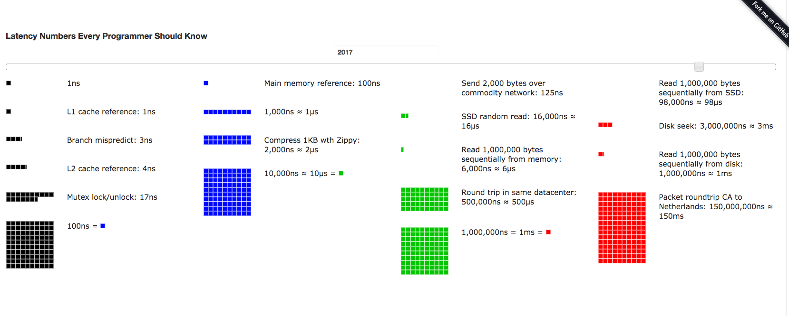

## Published at [eecs.berkeley](https://people.eecs.berkeley.edu/~rcs/research/interactive_latency.html)
Happy to push out a new version if you get a pull request accepted!

## Visual Comparison Charts

## Latency Comparison Numbers

| Event                              | Nanoseconds   | Microseconds | Milliseconds | Comparison    |
|------------------------------------|--------------:|--------:|----:|-----------------------------|
| L1 cache reference                 |           0.5 |       - |   - | -                           |
| Branch mispredict                  |           5.0 |       - |   - | -                           |
| L2 cache reference                 |           7.0 |       - |   - | 14x L1 cache                |
| Mutex lock/unlock                  |          25.0 |       - |   - | -                           |
| Main memory reference              |         100.0 |       - |   - | 20x L2 cache, 200x L1 cache |
| Compress 1K bytes with Zippy       |       3,000.0 |       3 |   - | -                           |
| Send 1K bytes over 1 Gbps network  |      10,000.0 |      10 |   - | -                           |
| Read 4K randomly from SSD          |     150,000.0 |     150 |   - | ~1GB/sec SSD                |
| Read 1 MB sequentially from memory |     250,000.0 |     250 |   - | -                           |
| Round trip within same datacenter  |     500,000.0 |     500 |   - | -                           |
| Read 1 MB sequentially from SSD    |   1,000,000.0 |   1,000 |   1 | ~1GB/sec SSD, 4X memory     |
| Disk seek                          |  10,000,000.0 |  10,000 |  10 | 20x datacenter roundtrip    |
| Read 1 MB sequentially from disk   |  20,000,000.0 |  20,000 |  20 | 80x memory, 20X SSD         |
| Send packet CA → Netherlands → CA  | 150,000,000.0 | 150,000 | 150 | -                           |

### Unit Reference
* `1` ns = `10^-9` seconds
* `1` µs = `10^-6` seconds = `1,000` ns
* `1` ms = `10^-3` seconds = `1,000` µs = `1,000,000` ns

### Credit/Notes
* Originally by [Peter Norvig](http://norvig.com/21-days.html#answers)

**Note**: "Forked" from [Latency Numbers Every Programmer Should Know](https://gist.github.com/GLMeece/b00c9c97a06a957af7426b1be5bc8be6)
